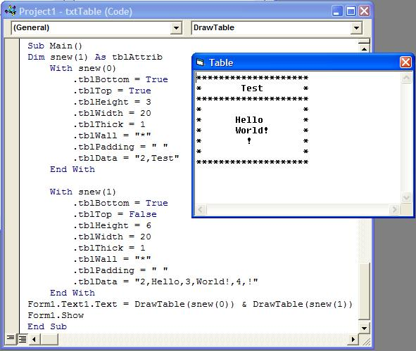



## Text Table Generator

### Description

This code lets you easily create text-tables for text documents or even comment-formatting in VB. This will automatically center your text in the table. *No error checking has been added, sorry!
 
### More Info
 
Uses a public TYPE to set all required data.

No error checking in the code. Examples of errors may be writing a line of text past the end of the table, and making the walls thicker than the table width.

Full table in a string that may be put into a textbox

             |
---                |---
**Submitted On**   |2002-07-30 22:00:28
**By**             |[TheMouse](https://github.com/Planet-Source-Code/PSCIndex/blob/master/ByAuthor/themouse.md)
**Level**          |Intermediate
**User Rating**    |4.8 (19 globes from 4 users)
**Compatibility**  |VB 6\.0
**Category**       |[String Manipulation](https://github.com/Planet-Source-Code/PSCIndex/blob/master/ByCategory/string-manipulation__1-5.md)
**World**          |[Visual Basic](https://github.com/Planet-Source-Code/PSCIndex/blob/master/ByWorld/visual-basic.md)
**Archive File**   |[Text\_Table1127037302002\.zip](https://github.com/Planet-Source-Code/themouse-text-table-generator__1-37427/archive/master.zip)

